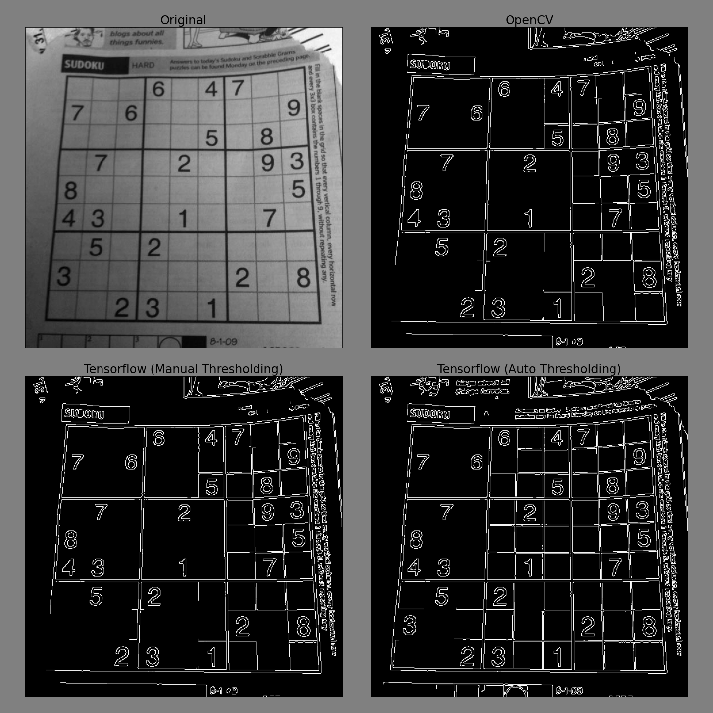

# Canny edge

An edge detection operation employing a set of algorithms introduced by John F. Canny. The steps to perform this operation are as follows:
1. Apply Gaussian filter to smooth the image in order to remove the noise.
2. Find the intensity gradients of the image.
3. Apply gradient magnitude thresholding or lower bound cut-off suppression to get rid of spurious response to edge detection.
4. Apply double threshold to determine potential edges.
5. Track edge by hysteresis: Finalise the detection of edges by suppressing all the other edges that are weak and not connected to strong edges.

***NOTE: Step 1 is omitted in order to be consistent with [OpenCV](https://github.com/opencv/opencv/blob/master/modules/imgproc/src/canny.cpp)'s implementation of the algorithm.*** 

## References

This module was built using the following resources as reference materials:
1. [Quang-Khai Tran's implementation](https://github.com/tqkhai2705/edge-detection)
2. [Wikipedia](https://en.wikipedia.org/wiki/Canny_edge_detector)
3. [Medium](https://towardsdatascience.com/canny-edge-detection-step-by-step-in-python-computer-vision-b49c3a2d8123)

## Usage

```python
import cv2
import numpy as np
import tensorflow as tf

import canny

# get the image
img = cv2.imread('sudoku.png' , cv2.IMREAD_GRAYSCALE)
img_tf = tf.expand_dims(tf.convert_to_tensor(img, dtype=tf.float32), axis=0)

# Mode 1: Manual threshold
# ---------------------------
canny_manual = canny.CannyEdge(weak_threshold=100, strong_threshold=200)
edges_tf_manual = canny_manual(img_tf)


# Mode 2: Automatic threshold
# ---------------------------
canny_auto = canny.CannyEdge()
edges_tf_auto = canny_auto(img_tf)
```

## Results

### Image



### Time

#### Environment
```
CPU: Intel(R) Core(TM) i7-9700K CPU @ 3.60GHz
GPU: GeForce RTX 2080 Ti
TensorFlow: 2.4.1
Python: 3.8.10
```
The python packages and their versions used during the development of this module can be found in [`requirements.txt`](requirements.txt).

#### Results

```
OpenCV: 0.0304 seconds for 100 reps of sudoku.png
Tensorflow (Manual Thresholding): 0.9486 seconds for a batch of 100 sudoku.png
Tensorflow (Auto Thresholding): 0.9317 seconds for a batch of 100 sudoku.png
```

