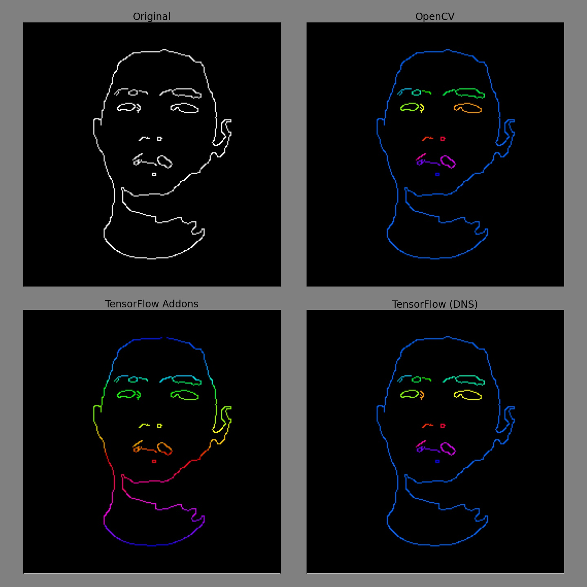

# Connected components

Segment labelling using connected component algorithms on binary (or boolean) images are used to determine connectivity of pixels. [TensorFlow Addons](https://www.tensorflow.org/addons/api_docs/python/tfa/image/connected_components) provides supports this task, however, it only considers 4-way connectivity (neighbors above, below, left, and right), unlike [OpenCV](https://docs.opencv.org/4.5.2/d3/dc0/group__imgproc__shape.html#gaedef8c7340499ca391d459122e51bef5), which supports both 4-way and 8-way connectivity options. To bridge this gap, this module employs [TensorFlow Addons' connected components](https://www.tensorflow.org/addons/api_docs/python/tfa/image/connected_components) operation to perform segment labelling based on 8-way connectivity.

## Usage

```python
import cv2
import tensorflow as tf

import connected_components

# get the image and convert to binary 1s and 0s
# image source: https://stackoverflow.com/questions/46441893/connected-component-labeling-in-python
img = cv2.imread('eGaIy.jpg', 0)
img = cv2.threshold(img, 127, 255, cv2.THRESH_BINARY)[1]

# get segment ids
segment_ids = connected_components.ConnectedComponents()(
    tf.cast(tf.expand_dims(tf.convert_to_tensor(img), axis=0), tf.bool)
)
```

## Results

### Image



### Time

#### Environment
```
CPU: Intel(R) Core(TM) i7-9700K CPU @ 3.60GHz
GPU: GeForce RTX 2080 Ti
TensorFlow: 2.4.1
Python: 3.8.10
```
The python packages and their versions used during the development of this module can be found in `requirements.txt`.

#### Results

```
OpenCV: 0.0220 seconds for 1000 reps of eGaIy.jpg
Tensorflow: 1.0147 seconds for a batch of 1000 eGaIy.jpg
```

